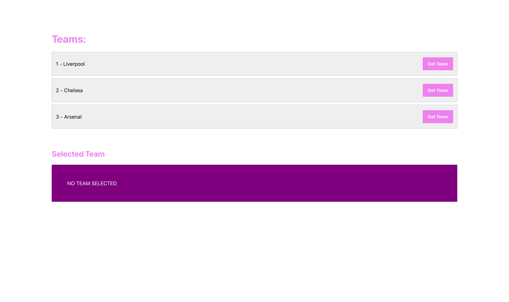

## TEAMS REACT APP FOR PACT.IO SPIKE

> &#9432; So.... 
> this is a **super simple react front end app**, which has one component we care about. **The Teams Component**. It makes a **GET Request** to our mock server and retrieves three simple teams data objects, **id and name**. Using this basic foundation we can then **install Pact**, write a simple test **to check the GET** returns the simple object and then extend the product to check if the consumer changes it's data etc. We can also extend this task out to encorporate a simple server side app which could be our provider and we stick the mock server behind that as a 3rd party data source.

### Resources: [pact.io documentation](https://pact.io/)

To get started do the following: 

1. install dependencies: 
    ```bash
    npm i
    ```
1. Then type `SHIFT + CMD + P` and select <font style="color: hotpink">**Terminals: Run**</font>
    - this boots up the mock server and the react UI
1. Should see this on [localhost:3000](http://localhost:3000/):
    
    